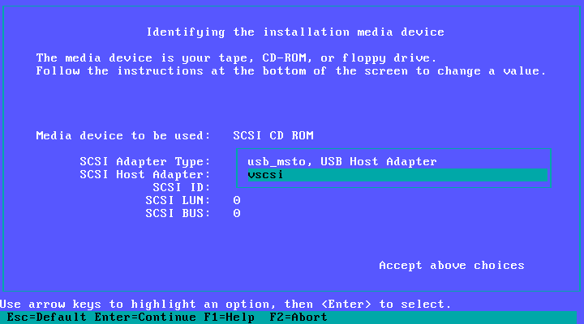
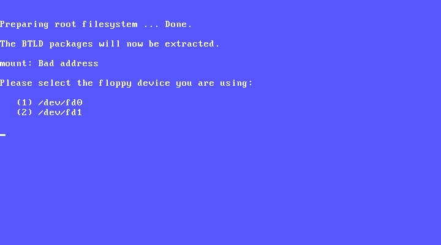
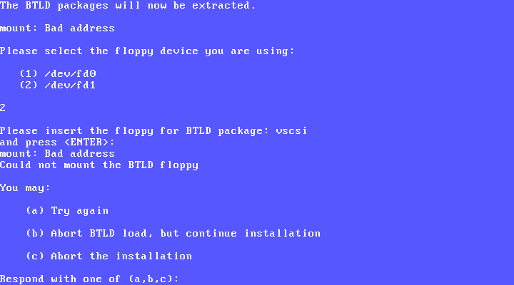
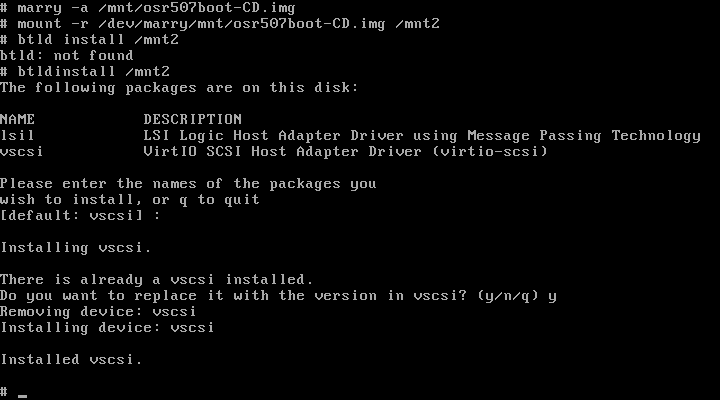

# Installing OpenServer on Proxmox

A normal OpenServer install, with three things to know about. They are flagged
below at the point you meet them, and none of them is difficult once you know.

Works for 5.0.6 and 5.0.7. Where they differ, it says so.

---

## 1. Create the VM

```sh
qm create 507 --name sco \
  --memory 1024 --cores 1 --sockets 1 \
  --machine pc-i440fx-9.0 --bios seabios --cpu pentium3 \
  --ostype other --vga std \
  --scsihw virtio-scsi-pci \
  --net0 virtio,bridge=vmbr0

qm set 507 --scsi0 local:iso/osr507-virtio-install-1.0.1.iso,media=cdrom
qm set 507 --scsi1 local-lvm:8,cache=writeback
qm set 507 --boot order=scsi0
```

If you are using the small boot CD rather than the one-disc installer, point
`--scsi0` at `osr507-virtio-btld-1.0.0.iso` and swap to your own OpenServer disc
when the installer asks for media.

| setting | why it matters |
|---|---|
| `pc-i440fx` | q35's PCIe breaks OpenServer. Not optional. |
| `virtio-scsi-pci` | this is the transitional device, which exposes the legacy I/O interface the driver uses |
| `cpu pentium3` | modern CPU models advertise CPUID features OpenServer chokes on |
| `bios seabios` | SeaBIOS can boot from virtio-scsi, including the CD |
| `memory 1024` | enough for a typical workload. OpenServer tops out near 3 GB: assign 4 GB and it reports 3 GB. |

### Why the CD-ROM goes on scsi0

This is the one design decision worth understanding, because it is what keeps
IDE out of the picture.

Proxmox gives each device a LUN based on its slot number. `scsi0` becomes LUN 0,
`scsi1` becomes LUN 1, and so on. OpenServer's CD-ROM driver, `Srom`, does not
handle LUNs at all. Whatever you configure, every command it issues goes to
LUN 0.

So a CD-ROM in any slot except `scsi0` gets answered by whatever is at LUN 0,
which is normally your hard disk. The symptom is a CD-ROM that identifies itself
as `QEMU HARDDISK`, and every read failing with an I/O error.

The disk driver, `Sdsk`, has no such limitation and is quite happy at LUN 1. So
give the CD-ROM slot 0, and let the disk take slot 1.

---

## 2. Boot the installer

At the `Boot :` prompt:

```
defbootstr link=vscsi btld=fd(64) Sdsk=vscsi(0,0,1) Srom=vscsi(0,0,0) clock.disable_short_timers=1
```


- `link=vscsi btld=fd(64)` loads the driver from the boot image itself
- `Sdsk=vscsi(0,0,1)` says the disk is at LUN 1
- `Srom=vscsi(0,0,0)` says the CD-ROM is at LUN 0
- `clock.disable_short_timers=1` is unrelated to the driver, but you want it.
  OpenServer programs the legacy timer for periods KVM clamps, so the guest
  clock drifts. If you are unsure whether your release has the tunable, look for
  it in `/etc/conf/pack.d/clock/space.c` on the installed system.

Answer the `Please insert the fd(64)vscsi volume` prompt with Return. The volume
is the boot image you are already booting from.

Both devices should appear:


`hds=255 secs=63` is the check that matters. That geometry is what SeaBIOS
computes on its own, so nothing has to be forced and the disk attaches as an
ordinary managed Proxmox disk. Snapshots, backups and clones all work.

---

## 3. Run the installer

> ### Thing to know #1: the media screen picks the wrong adapter
>
> "Identifying the installation media device" reports the right address, but
> defaults **SCSI Adapter Type** to `usb_msto, USB Host Adapter`. Press Space
> and choose `vscsi`. There are only two entries.
>
> 

> ### Thing to know #2: loading the BTLD into the link kit fails
>
> This is expected, and documented by SCO. You will see:
>
> 
>
> Choose **(2)**, press Return at the "insert the floppy" prompt, and when it
> fails again choose **(b) abort BTLD load, but continue installation**.
>
> 
>
> The install completes normally. The driver goes into the installed kernel in
> the next step.

Everything else is a standard OpenServer install.

---

## 4. Put the driver into the installed kernel

The install is finished, but the on-disk kernel has no driver yet, so it cannot
boot on its own. Boot from the CD once more, onto the installed root.

At the `Boot :` prompt:

```
defbootstr link=fd(64)vscsi root=hd(42) Sdsk=vscsi(0,0,1) Srom=vscsi(0,0,0) clock.disable_short_timers=1
```

> ### Thing to know #3: do this from single-user mode
>
> If you press Ctrl-D past single user, you are running the install kernel
> against the installed system's `inittab`, which expects twelve console screens
> the install kernel does not provide. Each one fails and retries, and your
> console fills with:
>
> ```
> INIT: Command is respawning too rapidly.
> ```
>
> It is harmless, but it lands on top of the commands you are about to type.
> Stay in single user.

Then:

```sh
mount /dev/cd0 /mnt
mkdir /mnt2
marry -a /mnt/osr507-virtio-btld.img
mount -r /dev/marry/mnt/osr507-virtio-btld.img /mnt2
btldinstall /mnt2                 # take the default: vscsi
/etc/conf/cf.d/link_unix -y
umount /mnt2
marry -d /dev/marry/mnt/osr507-virtio-btld.img
umount /mnt
haltsys
```



> **Do not skip `link_unix`.** `btldinstall` prints a success message and stops
> without touching `/stand/unix`, so it reads as finished when it is not. Skip
> it and the next boot panics with
> `PANIC: srmountfun - Error 19 mounting rootdev`, which looks like a much worse
> problem than it is.

On 5.0.6 there are two differences here:

1. The image is called `osr506-virtio-btld.img`.
2. `mount /dev/cd0 /mnt` fails with `No such device`. The installed system gives
   `Srom` major number 47, but the install kernel you are running uses 51. Use a
   throwaway device node instead. Leave `/dev/cd0` alone, it is correct once you
   are booted normally:

   ```sh
   mknod /tmp/c51 b 51 0
   mount -r /tmp/c51 /mnt
   ```

   Also, `link_unix -y` still asks two questions on 5.0.6, "boot by default?"
   and "kernel environment rebuilt?". Answer `y` to both.

---

## 5. Boot from the disk

```sh
qm set 507 --boot order=scsi1
```

That is the only change. Start it, with no boot string:


`rootdev = 1/42` is the ordinary value. OpenServer's device numbering follows
the disk's unit number rather than its SCSI LUN, so a root disk at LUN 1 changes
nothing.

It is worth confirming the installer wrote the right map. It does this
unprompted on both releases:

```sh
grep -v '^\*' /etc/conf/cf.d/mscsi
vscsi	Srom	0	0	0	0
vscsi	Sdsk	0	0	1	0
```

Then set up the network: [NETWORK.md](NETWORK.md).

---

## Upgrading an existing system

If OpenServer is already installed, on IDE, on an emulated LSI card, or
anywhere else, you do not need to reinstall.

```sh
mount -r -f HS,lower /dev/cd0 /mnt
pkgadd -d /mnt/drivers/vscsi-1.0.0.pkg all
```

Or download [`vscsi-1.0.0.pkg`](download/vscsi-1.0.0.pkg) directly.

The package stages the driver and registers it with the Link Kit, but does not
relink. This is the root disk driver, so you choose the moment:

```sh
/etc/conf/cf.d/link_unix -y
reboot
```

`link_unix` backs the running kernel up to `/stand/unix.old` first. If the new
one will not boot, type `hd(40)unix.old` at the Boot prompt to get back in.

If you are adding a virtio disk to a machine that boots from something else, add
its `mscsi` line, `vscsi Sdsk 0 0 N 0` for LUN N, then run `mkdev hd` to
partition it.

---

## Adding more disks

Extra disks go in higher slots and get correspondingly higher LUNs:

```sh
qm set 507 --scsi2 local-lvm:32
```
```
vscsi	Sdsk	0	0	2	0      <- in /etc/conf/cf.d/mscsi
```

Then `mkdev hd`, relink and reboot.

The driver handles up to four controllers, `ha=0` to `ha=3`, if you use
`--scsihw virtio-scsi-single`, which gives each disk its own. On a
multiprocessor guest stay with `virtio-scsi-pci` instead, because
`virtio-scsi-single` puts the controllers behind a PCI bridge that MPX cannot
route interrupts through.

---

## Troubleshooting

**`error loading hd(40)/boot` when booting from disk.** Geometry mismatch. The
disk was installed under a different translation to the one the BIOS reports.
This should not happen with these images, which report 255/63 to match SeaBIOS.
On an older install, `dparam(ADM)` can rewrite the master boot block.

**`PANIC: srmountfun - Error 19 mounting rootdev`.** The kernel loaded but has
no driver in it, which means `link_unix` was skipped after `btldinstall`. Boot
the CD again and run it.

**CD-ROM reads fail and it identifies as `QEMU HARDDISK`.** The CD is not on
`scsi0`. See [why the CD-ROM goes on scsi0](#why-the-cd-rom-goes-on-scsi0).

**The machine keeps booting the CD after installing.** Set
`qm set 507 --boot order=scsi1`.

**The guest clock drifts.** Add `clock.disable_short_timers=1` to `DEFBOOTSTR`
in `/etc/default/boot` so it applies to every boot, not just the one you typed
it on.
