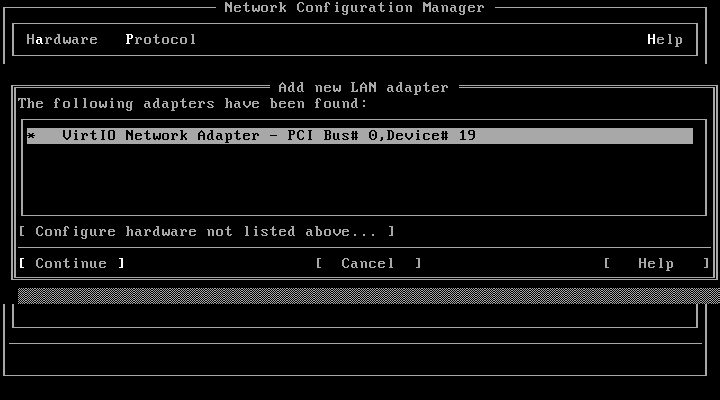

# Networking

`vnet` is an MDI network driver, so OpenServer's own TCP/IP stack drives a
virtio-net device. `scoadmin` finds it by PCI ID, configures it, and it behaves
like any other adapter afterwards.

## Why it is worth installing

Throughput is vastly improved over the emulated adapter OpenServer would
otherwise use. It is the difference between a machine you can copy files to and
one you avoid copying files to.

Measured with 200 MB of incompressible data over plain HTTP, three passes each,
no encryption in the way, and the source file resident in cache so the figures
reflect the network path rather than the disk:

| direction | throughput |
|---|---|
| host to guest | 123-131 MB/s, about 1 Gbit/s |
| guest to host | 50-53 MB/s, about 400 Mbit/s |

Receive is faster than transmit, which is normal for this kind of driver.

**Your numbers will differ.** These were taken on:

- Dell OptiPlex 7090, Intel Core i5-10505 at 3.20 GHz, 12 threads, 16 GB RAM
- Proxmox VE 9.2.2
- Guest: OpenServer 5.0.7, MPX kernel, 2 CPUs, 3 GB RAM

Both endpoints were on the same host, so traffic stayed on the software bridge
and never touched a wire. Across a real 1 GbE LAN to a separate machine the same
test gave 60-66 MB/s receiving and 40-42 MB/s transmitting, which is the
physical link doing the limiting rather than the driver.

There is no link speed to negotiate. virtio has no PHY and no wire, so the 1 Gb
the driver reports is advisory metadata for tools and routing decisions rather
than a limit. The real ceiling is host CPU and memory bandwidth.

## Set up the VM

Give the VM a virtio NIC. If you are installing OpenServer from scratch, add it
when you create the VM but defer network configuration during the install,
because the installer has no driver for it yet.

```sh
qm set 507 --net0 virtio,bridge=vmbr0
```

## Install the driver

The package is [`vnet-1.0.0.pkg`](download/vnet-1.0.0.pkg), 78 KB. It is also in
`/drivers` on the one-disc installers, which is the easy route for a machine
that has no working network yet:

```sh
mount -r -f HS,lower /dev/cd0 /mnt
pkgadd -d /mnt/drivers/vnet-1.0.0.pkg all
```

## Configure the adapter

```
scoadmin
```

Go to **Network Configuration Manager**, then **Hardware**, then **Add New LAN
Adapter**. It appears as "VirtIO Network Adapter", because SCO's own hardware
scan matches the PCI ID and names it without prompting:



Set the address in the same tool. Adding the adapter relinks the kernel itself,
which is the several-minute pause, then reboot when it asks.

That is all there is to it. `ifconfig -a` should show `net0` with your address,
and it is an ordinary SCO network interface from then on.
