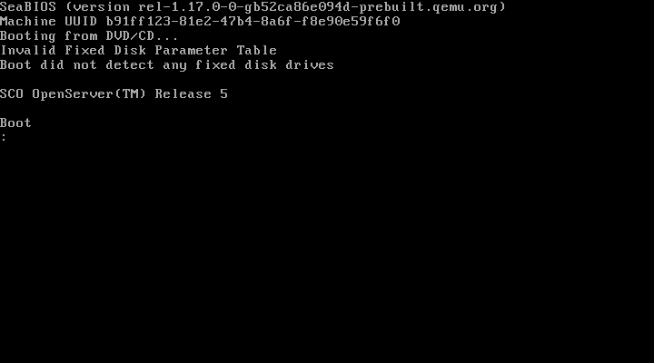
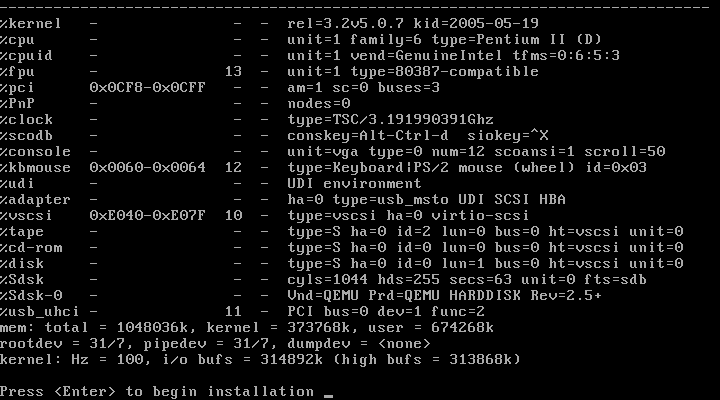
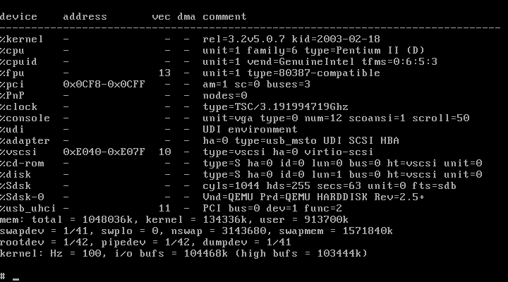

# SCO OpenServer on Proxmox

VirtIO drivers that let **SCO OpenServer 5.0.6 and 5.0.7** run on Proxmox VE,
and on any other QEMU/KVM host, with paravirtualised disk and network.

You can install OpenServer directly onto a virtio disk, boot from it with no
boot string, and run with no emulated IDE hardware at all.

```
%vscsi    0xE040-0xE07F  10  -  type=vscsi ha=0 virtio-scsi
%cd-rom   -  -  -  type=S ha=0 id=0 lun=0 bus=0 ht=vscsi
%disk     -  -  -  type=S ha=0 id=0 lun=1 bus=0 ht=vscsi
%Sdsk     -  -  -  cyls=1044 hds=255 secs=63 unit=0 fts=sdb
```

## Why

OpenServer has no virtio support of its own. Without it you are stuck with
emulated IDE or an emulated LSI SCSI card. Both are slow, and IDE brings its own
problems on a modern hypervisor.

If you are moving a legacy OpenServer box off ESXi, this is the missing piece.

## What you get

| | |
|---|---|
| **`vscsi`** | virtio-scsi host adapter driver. Boot disk, extra disks, CD-ROM. Up to four controllers. |
| **`vnet`** | virtio-net network adapter driver, configured through `scoadmin` like any other NIC. |

Both work on 5.0.6 and 5.0.7 from the same binary. The kernel interface is
identical between those releases.

## Downloads

Everything is in [`download/`](download/):

| file | what it is |
|---|---|
| [`osr507-virtio-btld-1.0.0.iso`](download/osr507-virtio-btld-1.0.0.iso) (3.2 MB) | boot CD for a **5.0.7** install. Use with your own OpenServer CD. |
| [`osr506-virtio-btld-1.0.0.iso`](download/osr506-virtio-btld-1.0.0.iso) (3.2 MB) | the same for **5.0.6** |
| [`vscsi-1.0.0.pkg`](download/vscsi-1.0.0.pkg) (72 KB) | disk driver for a system that is already installed |
| [`vnet-1.0.0.pkg`](download/vnet-1.0.0.pkg) (78 KB) | network driver |

The `.img` files are the same boot images without the CD wrapper, for writing to
real media. Checksums are in
[`download/SHA256SUMS.txt`](download/SHA256SUMS.txt).

There are also one-disc installers carrying the boot image and the OpenServer
product media together, so you need nothing else. They are too large for GitHub
and live on S3:

- [`osr507-virtio-install-1.0.0.iso`](https://sco-openserver-iso.s3.eu-west-2.amazonaws.com/Proxmox/osr507-virtio-install-1.0.0.iso) (300 MB)
- [`osr506-virtio-install-1.0.0.iso`](https://sco-openserver-iso.s3.eu-west-2.amazonaws.com/Proxmox/osr506-virtio-install-1.0.0.iso) (381 MB)

Those are hosted with Xinuos's permission. The drivers are MIT and separate from
that.

## Quick start

Create the VM. Put the CD-ROM on `scsi0` and the disk on `scsi1`. That detail is
what removes the need for any IDE hardware, and it is explained in
[INSTALL.md](INSTALL.md#why-the-cd-rom-goes-on-scsi0).

```sh
qm create 507 --name sco \
  --memory 1024 --cores 1 --sockets 1 \
  --machine pc-i440fx-9.0 --bios seabios --cpu pentium3 \
  --ostype other --vga std \
  --scsihw virtio-scsi-pci \
  --net0 virtio,bridge=vmbr0

qm set 507 --scsi0 local:iso/osr507-virtio-install-1.0.0.iso,media=cdrom
qm set 507 --scsi1 local-lvm:8,cache=writeback
qm set 507 --boot order=scsi0
```

Start it, and at the `Boot :` prompt type:

```
defbootstr link=vscsi btld=fd(64) Sdsk=vscsi(0,0,1) Srom=vscsi(0,0,0) clock.disable_short_timers=1
```



The driver loads and both devices appear. There is no IDE controller anywhere:



Then follow [INSTALL.md](INSTALL.md). It is a normal OpenServer install with
three things to know about, and the guide flags each one where you meet it.

When it is finished, set `qm set 507 --boot order=scsi1` and it boots from disk
on its own with no boot string:



## Already have OpenServer running?

You do not need to reinstall. Install the packages, relink, reboot:

```sh
mount -r -f HS,lower /dev/cd0 /mnt
pkgadd -d /mnt/drivers/vscsi-1.0.0.pkg all
pkgadd -d /mnt/drivers/vnet-1.0.0.pkg all
/etc/conf/cf.d/link_unix -y
reboot
```

The disk driver does not relink for you. It is the root disk driver, so you pick
the moment. `link_unix` backs the running kernel up to `/stand/unix.old` first,
so a kernel that will not boot is recoverable by typing `hd(40)unix.old` at the
Boot prompt.

There is more detail in [INSTALL.md](INSTALL.md#upgrading-an-existing-system)
and [NETWORK.md](NETWORK.md).

## No IDE at all

Most guides leave the CD-ROM on emulated IDE. That drags SCO's `wd` driver into
your kernel permanently, to serve a device you only needed during the install.
You can avoid it.

Put the CD-ROM on `scsi0` and the disk on `scsi1` and the machine has no IDE
controller. The installer notices, and leaves `wd`, `wdex` and `wdha`
unconfigured on its own. Nothing needs stripping by hand:

```sh
grep '^wd' /etc/conf/cf.d/sdevice
wd	N	2	5	0	0	0	0	0	0
```

`N` means not linked in. On a test install that made the kernel about 240 KB
smaller, and it is one less emulated device on the host.

## Requirements

- Proxmox VE, tested on 9.2.2, or any QEMU/KVM host
- Machine type `pc-i440fx`. q35's PCIe breaks OpenServer.
- SeaBIOS, `virtio-scsi-pci`, and `--cpu pentium3` or similar. Modern CPU models
  advertise features OpenServer chokes on.
- 1 GB RAM is enough for a typical workload. OpenServer tops out near 3 GB:
  assign 4 GB and it reports 3 GB.
- Your own OpenServer 5.0.6 or 5.0.7 media, unless you use a one-disc installer.

If you plan to run the multiprocessor (MPX) kernel, check that
`/sys/module/kvm_intel/parameters/enable_apicv` reads `Y` on the host first.
OpenServer implements `spl()` as a local APIC task priority register write. On a
host without APIC virtualisation every one of those traps and is emulated, and
the guest runs roughly 60 times slower. Anything Haswell-era or newer is fine.

## Building from source

You do not need this to use the drivers. The source is here, and OpenServer can
build it with no compiler licence, because the Link Kit ships a complete
toolchain:

```sh
sh build.sh vscsi     # -> pkg/Driver.o
sh build.sh vnet
```

Each driver bundles its own private copy of the shared virtio transport, so both
can live in one kernel.

## Licence

MIT, see [LICENSE](LICENSE). The boot images embed SCO/Xinuos boot code, and the
one-disc installers carry their product media. Those are hosted with Xinuos's
permission and are not covered by the MIT licence.
